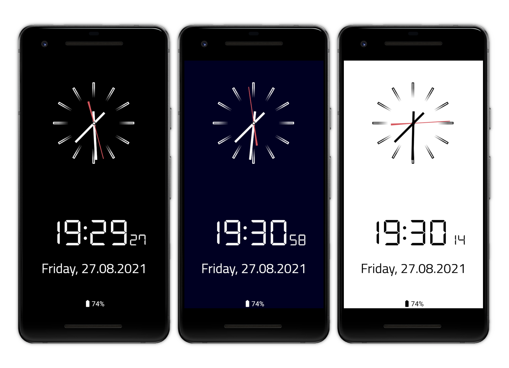

# Android Fullscreen Clock Screensaver
[](https://play.google.com/store/apps/details?id=systems.sieber.fsclock)
[](https://www.amazon.com/gp/product/B09BK3HQJ9)
[](https://f-droid.org/packages/systems.sieber.fsclock)
[](https://github.com/schorschii/FsClock-Android/releases)

Simple Fullscreen Clock Screensaver

- analog and digital clock can be activated or deactivated individually
- optional date and weekday view with custom format option
- displays alarms and appointments from Android calendar or internal event database
- adjustable background and clock color
- can be set as Android system screensaver ("DayDream") on smartphones and tablets
- compatible with Android TV devices
- content can be moved slightly to prevent burn-in on OLED displays

## Please Support the Development!
**Do you like this app? Please consider supporting the development by purchasing the in-app purchase (which unlocks the advanced settings) in one of the App Stores or by getting a settings unlock code via [Github sponsorship](https://github.com/sponsors/schorschii).**

Open Source means free as "free speech" [but not as in "free beer"](https://en.wikipedia.org/wiki/Gratis_versus_libre). At first glance, it may not look like it, but even this "tiny" clock app takes a lot of time to maintain because of the quirks of different Android versions and devices in combination with auto text sizing and the DreamService implementation (FireTV!!!).

## Screenshots


## Screensaver on Amazon FireOS / FireTV
Works only up to FireOS 7.x. On FireOS 8 and newer, it currently no longer seems to be possible to set a custom screensaver.

Amazon FireOS (on FireTV devices) does currently not officially allow changing the system screensaver to another (3rd-party) app. While nobody understands this decision Amazon made, there is a workaround possible using the Android developer tools, which works up to FireOS 7. Without this workaround, the clock can still be started on FireTV devices like a normal app.

1. Enable Debugging on your FireTV.  
   All details (including how to install ADB on your computer) are described [here](https://developer.amazon.com/docs/fire-tv/connecting-adb-to-device.html).

2. Execute the following command:
   ```
   # execute this command to set this app as screensaver
   # please note: after that, the FireTV settings app still shows the Amazon screensaver, but the underlying Android system will now start the clock instead
   adb shell settings put secure screensaver_components systems.sieber.fsclock/systems.sieber.fsclock.FullscreenDream

   # if you want to restore the Amazon default screen saver, execute the following command
   adb shell settings put secure screensaver_components com.amazon.ftv.screensaver/.app.services.ScreensaverService
   ```
